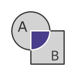
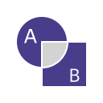

# iOverlay

<p align="center">


</p>

The iOverlay is a fast poly-bool library supporting main operations like union, intersection, difference, and XOR, governed by either the even-odd or non-zero rule. This algorithm is based on Vatti clipping ideas but is an original implementation.


## [Documentation](https://ishape-rust.github.io/iShape-js/overlay/stars_demo.html)
Try out iOverlay with an interactive demo. The demo covers operations like union, intersection, difference and exclusion

- [Stars Rotation](https://ishape-rust.github.io/iShape-js/overlay/stars_demo.html)
- [Shapes Editor](https://ishape-rust.github.io/iShape-js/overlay/shapes_editor.html)


## Features

- **Operations**: union, intersection, difference, and exclusion.
- **Polygons**: with holes, self-intersections, and multiple paths.
- **Simplification**: removes degenerate vertices and merges collinear edges.
- **Fill Rules**: even-odd and non-zero.


## Working Range and Precision
The i_overlay library operates within the following ranges and precision levels:

Extended Range: From -1,000,000 to 1,000,000 with a precision of 0.001.
Recommended Range: From -100,000 to 100,000 with a precision of 0.01 for more accurate results.
Utilizing the library within the recommended range ensures optimal accuracy in computations and is advised for most use cases.


## Getting Started

Add the following to your Cargo.toml:
```
[dependencies]
i_float
i_shape
i_overlay
```

### Example

Here is a simple example that demonstrates how to use the iOverlay library for polygon union operations.
```rust
use i_float::fix_vec::FixVec;
use i_overlay::{layout::overlay::Overlay, fill::shape_type::ShapeType, bool::fill_rule::FillRule};

fn main() {
    let mut overlay = Overlay::new(1);
        
    let subj = [
        FixVec::new_number(-10, -10),
        FixVec::new_number(-10,  10),
        FixVec::new_number( 10,  10),
        FixVec::new_number( 10, -10)
    ];

    let clip = [
        FixVec::new_number(-5, -5),
        FixVec::new_number(-5, 15),
        FixVec::new_number(15, 15),
        FixVec::new_number(15, -5)
    ];

    overlay.add_path(subj.to_vec(), ShapeType::SUBJECT);
    overlay.add_path(clip.to_vec(), ShapeType::CLIP);

    let graph = overlay.build_graph();

    let shapes = graph.extract_shapes(FillRule::Union);

    println!("shapes count: {}", shapes.len());

    if shapes.len() > 0 {
        let contour = shapes[0].contour();
        println!("shape 0 contour: ");
        for p in contour {
            let x = p.x.float();
            let y = p.x.float();
            println!("({}, {})", x, y);
        }
    }
}
```

# Overlay Rules

## Union, A or B


## Intersection, A and B


## Difference, B - A


## Exclusion, A xor B
